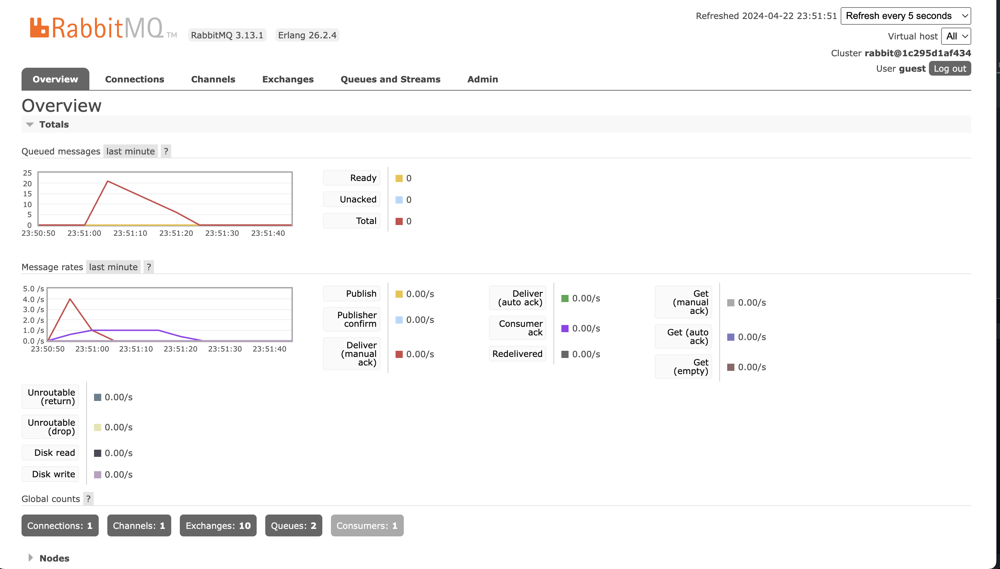
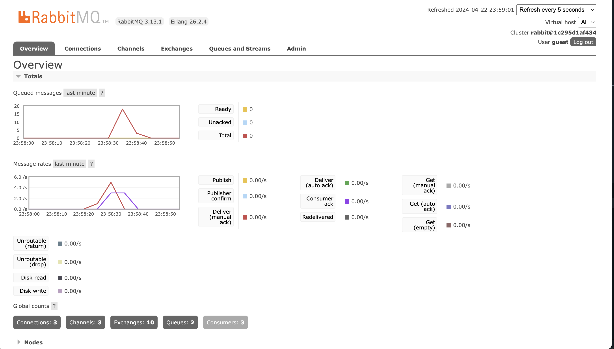
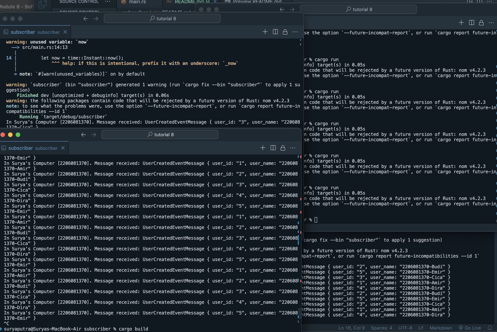

### a. what is amqp?
AMQP adalah singkatan dari Advanced Message Queuing Protocol. Ini adalah protokol jaringan yang memungkinkan klien untuk berkomunikasi dengan broker pesan, yang memfasilitasi komunikasi yang terurut di antara aplikasi. AMQP didefinisikan sebagai protokol yang berbasis pada pertukaran pesan yang membuatnya sangat berguna untuk sistem yang memerlukan komunikasi antar layanan yang stabil dan efisien, seperti dalam aplikasi berbasis cloud dan microservices.

### b.  what it means? guest:guest@localhost:5672 , what is the first guest, and what is the second guest, and what is localhost:5672 is for?
Bagian ini dari URL AMQP dapat dipecah menjadi beberapa komponen:
("guest" pertama) adalah username yang digunakan untuk mengakses broker pesan. Dalam hal ini, "guest" adalah username default yang sering digunakan dalam konfigurasi RabbitMQ yang dijalankan di lingkungan lokal.

("guest" kedua) adalah password yang digunakan bersama dengan username untuk autentikasi ke broker pesan. Password ini juga "guest" yang merupakan pasangan default untuk username di banyak broker pesan.

localhost:5672 adalah alamat server tempat broker pesan berjalan. "localhost" berarti broker pesan berjalan pada mesin lokal yang sama dengan klien yang mengaksesnya. Angka "5672" adalah port yang digunakan untuk mengakses RabbitMQ, yang merupakan implementasi dari AMQP.

Dalam gambar tersebut terlihat ada 20 pesan yang tertumpuk dalam antrian. Kondisi ini muncul karena subscriber membutuhkan waktu tambahan untuk memproses setiap event yang masuk ke dalam antrian pesan, yang mengakibatkan akumulasi pesan. Hal ini terjadi karena laju pengiriman pesan oleh publisher melebihi kecepatan subscriber dalam mengonsumsi pesan tersebut.

Pada gambar tersebut memperlihatkan bahwa setiap subscriber menerima data yang unik ketika publisher mentransmisikan sejumlah data ke dalam antrian pesan. Ini terjadi karena setiap subscriber beroperasi sebagai aplikasi independen, memproses dan mengambil data secara terpisah dari antrian pesan. Setelah sebuah pesan diambil dari antrian, pesan tersebut kemudian dihapus, sehingga tidak dapat diakses atau digunakan oleh aplikasi lain.

Saya berpendapat untuk meningkatkan kinerja aplikasi subscriber, pendekatan yang efektif adalah dengan mengimplementasikan multithreading. Dengan demikian, aplikasi dapat menangani beberapa event dari publisher secara bersamaan, mempercepat pemrosesan dan meningkatkan throughput secara keseluruhan.

